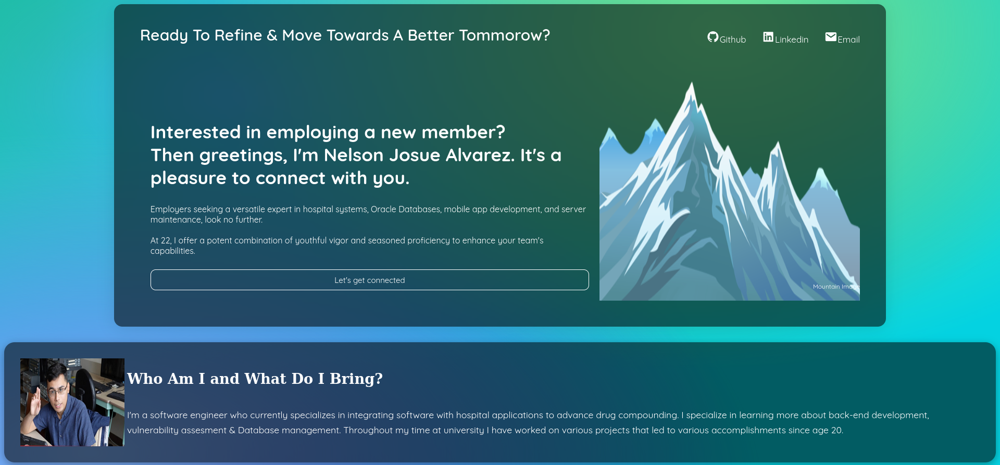
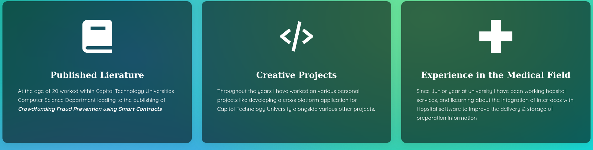

# Personal Portfolio project   
In this GitHub repository what we will first do is construct a portfolio page for ourselves DebuggingaHopper / roaringFlame So what is the objective of the page? 

The objective of the page is for the user to be able to see from first glimpse who we are as an employee, so how do we get their attention: 

1. Introduce ourselves and our current experience within Loccioni USA as a Software Engineer who specializes in integrating Hospital applications with interfaces to deliver information. What we want to focus on is a focus of back-end development & database management. 
2. Display Personal projects that we work on 
3. Display our interest in back-end development & database management with Postgres SQL project with Docker container 
4. Display interest in Vulnerability management

## Initial Design of the page

This is how I wanted to cosntruct this webpage initially

## What was accomplished

A very simple webpage that displays who I am with a simple dashboard and cards.  Below is the final result of the project which I titled ProtoPortfolio:

## Next steps

You will notice within my repository there is HoppingPortfolio which was the next step after this project was completed. Insetad of using normal html, and css I decided to utilize nextjs and typescript to construct the next version of this project.

